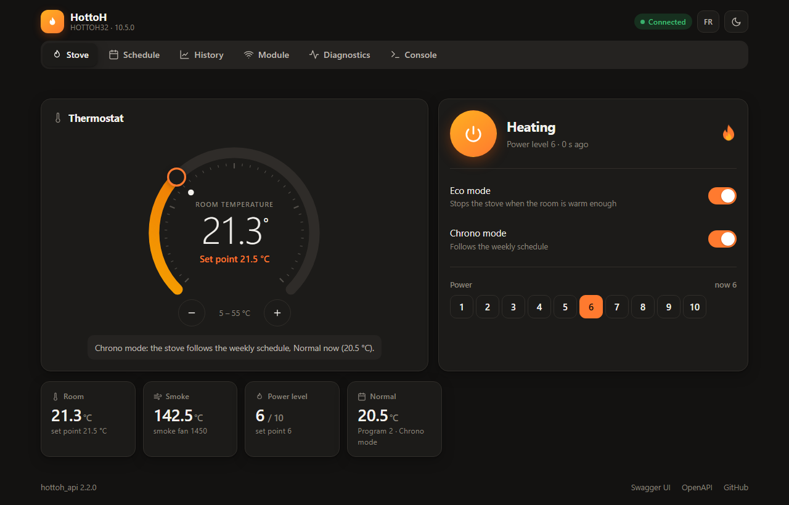
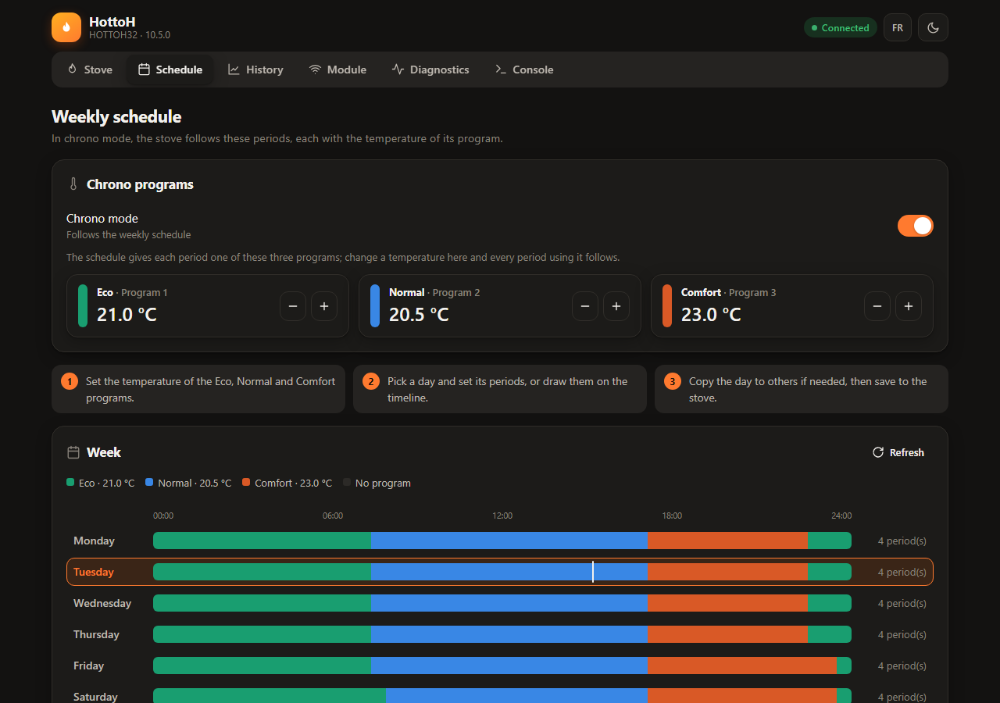
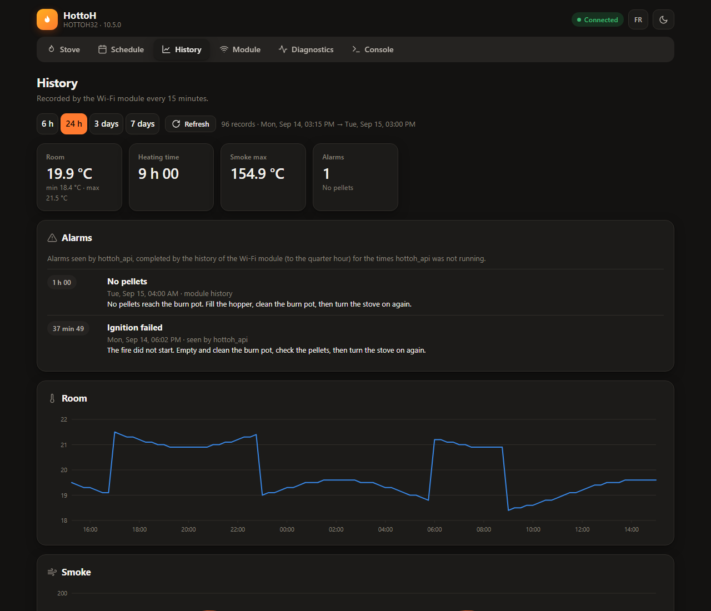
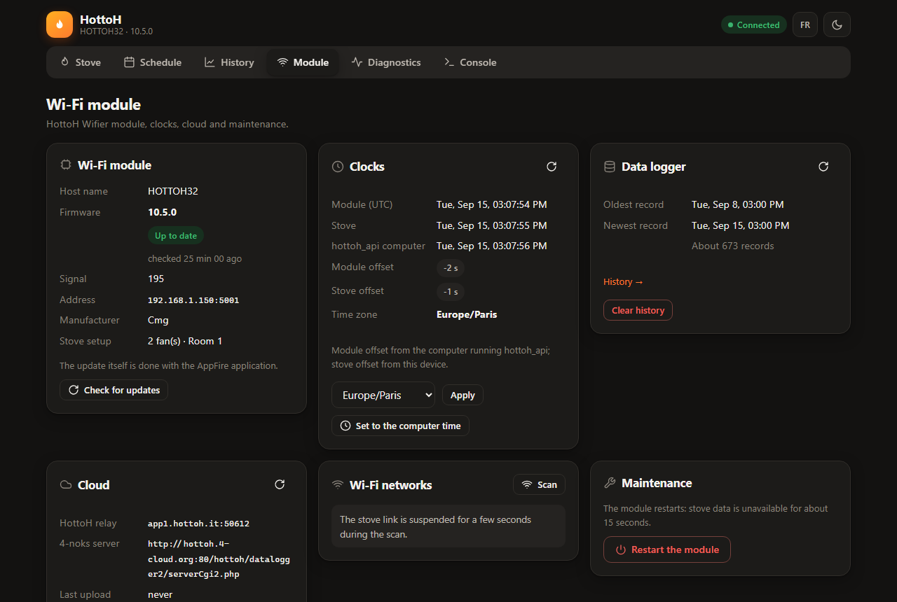
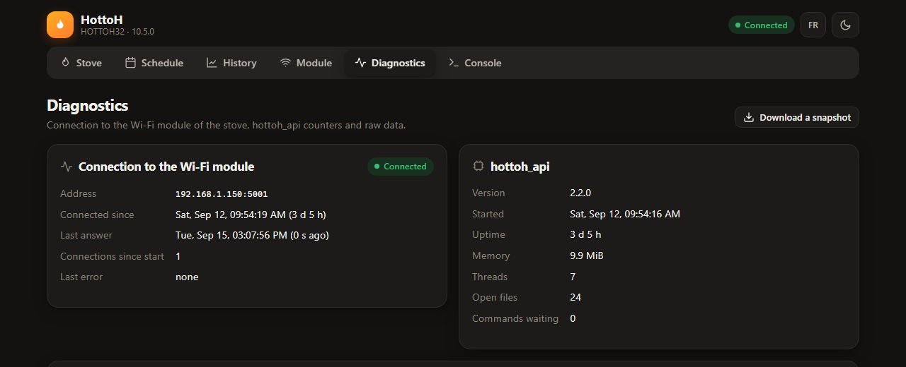
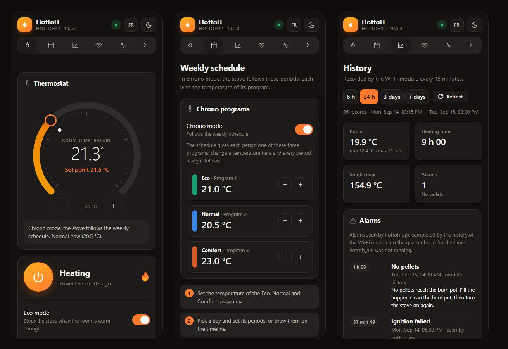

# HottoH API

[](https://github.com/jer-nz/hottoh_api/actions/workflows/ci.yml)
[](https://github.com/jer-nz/hottoh_api/actions/workflows/release.yml)
[](https://github.com/jer-nz/hottoh_api/releases/latest)
[](LICENSE)

**Control your HottoH pellet stove from your browser, on your own network, without the cloud.**

hottoh_api talks directly to the HottoH Wi-Fi module of the stove (the one used by the AppFire
app, found on CMG, Edilkamin and other brands) and gives you a modern web interface and an HTTP
API. One small program, no installation required, no account, nothing leaves your home.



## Two ways to use it

| | **Standalone app** | **Service** |
|---|---|---|
| For | Trying it out, occasional use from a computer | A home server, a Raspberry Pi, home automation |
| How | Download, run, done | Alpine or Debian package, or the static Linux binary |
| Configuration | None: the stove is found on the network | A short `config.ini` |
| You get | The web interface, opened in your browser | The web interface **and** the HTTP API, reachable from any device of the network: phone, tablet, Home Assistant, scripts |

Both run the same program: the service is the standalone app with a configuration file.

## What you can do

- **Thermostat**: room temperature and set point on a dial, on/off, eco and chrono modes, power
  level, fans, every sensor of the stove.
- **Weekly schedule**: the Eco, Normal and Comfort programs, a week overview, periods drawn on a
  timeline, a day copied to the others in one click.
- **History**: charts of room and smoke temperatures and power over 6 hours to 7 days, heating
  time, alarm history, from the data logger built into the Wi-Fi module.
- **Alarms explained**: out of pellets, ignition failure, door open… with what to do.
- **Wi-Fi module**: firmware and update check, clocks and time zone, cloud relay, restart.
- **Diagnostics**: link quality, counters, raw data and a JSON snapshot for bug reports.
- **HTTP API** with Swagger UI, for automations ([API documentation](docs/API.md)).
- English and French, dark and light themes, works on a phone.
- Tiny: about 10 MiB of memory, a single file with the interface embedded.

| Weekly schedule | History |
|---|---|
|  |  |
| **Wi-Fi module** | **Diagnostics** |
|  |  |



## Quick start: standalone app

1. Download the program for your computer from the
   [latest release](https://github.com/jer-nz/hottoh_api/releases/latest):
   `hottoh_api-windows-amd64.exe` (Windows), `hottoh_api-macos-arm64` (macOS, Apple silicon), or
   the `linux` archive. The computer must be on the same network as the stove.
2. **Close the AppFire app on your phone**, or switch it to cloud mode (see
   [below](#one-local-connection-at-a-time)).
3. Run the program. The binaries are not signed: on Windows, SmartScreen may ask for confirmation
   (More info → Run anyway); on macOS, make it executable first
   (`chmod +x hottoh_api-macos-arm64`), then allow it once in System Settings → Privacy & Security.

hottoh_api searches the network for the stove and opens `http://127.0.0.1:3000/` in your browser.
Keep its window open while you use it. In this mode the interface is only reachable from this
computer.

## Quick start: service

Each release has packages that install hottoh_api as a service, with a `hottoh` system user and
logs in `/var/log/hottoh_api/`. The service is not started at installation, and your
`config.ini` is kept on upgrade:

```sh
# Debian / Ubuntu / Raspberry Pi OS (amd64, arm64)
sudo dpkg -i hottoh-api_2.2.0_amd64.deb
sudo editor /etc/hottoh_api/config.ini
sudo systemctl enable --now hottoh_api

# Alpine (the package is not signed)
apk add --allow-untrusted hottoh-api_2.2.0_amd64.apk
vi /etc/hottoh_api/config.ini
rc-update add hottoh_api default && rc-service hottoh_api start
```

A minimal configuration, to reach the interface and the API from the whole network:

```ini
[stove]
ip = 192.168.1.50     # address of the stove, or auto to search the network

[http_api]
ip = 0.0.0.0          # every interface (default: this computer only)
port = 3000
```

Then open `http://<server>:3000/` for the interface and `http://<server>:3000/swagger-ui/` for the
API. Every setting (ports, logs, optional module features) is described in the
[configuration guide](docs/CONFIGURATION.md). On other systems, use the static binary of the
`linux` archive, which also contains OpenRC and systemd service files.

## Home Assistant

A **Home Assistant integration, installable through HACS, is coming soon.** Until then, the HTTP
API works with the `rest` and `rest_command` integrations: see the
[example](docs/API.md#home-assistant).

## One local connection at a time

The HottoH Wi-Fi module accepts **a single local connection**. While hottoh_api is connected, any
other local client is refused, including a second hottoh_api and the
[AppFire](https://play.google.com/store/apps/details?id=com.hottoh.appfire) app when it connects
locally.

To keep using AppFire, enable the **cloud mode** of the module in the app: AppFire then goes
through the HottoH cloud relay and both work side by side.

## Compatibility

- Stoves with the HottoH Wi-Fi module "Wifier 2.0", reachable on the local network (TCP port 5001).
- Built and tested against module firmware **10.5.0**, on a real stove. Firmware 10.1.0 and below
  work too, but may drop their Wi-Fi link every few minutes: if that happens, updating them with
  AppFire is recommended ([how](docs/WIFI_DROPS.md)).
- Windows (amd64), macOS (Apple silicon), Linux (amd64, arm64).

> **You cannot connect your stove to Wi-Fi, or it keeps dropping off every five minutes or so?**
> It is most likely a bug of the module firmware 10.1.0 and below, not your network, and the
> module drops off too fast to be updated as it is. Read [why it happens and how to update it anyway](docs/WIFI_DROPS.md).

## Security

The interface and the API have **no authentication**: anyone who can reach the port can turn the
stove on or off. Keep hottoh_api on a trusted network, and use a VPN to reach it from outside
rather than exposing it to the Internet. Settings that change the module setup, delete data or
restart the module are disabled by default ([`[features]`](docs/CONFIGURATION.md#features)).

## Documentation

- [Configuration](docs/CONFIGURATION.md): every setting, stove search, logs.
- [HTTP API](docs/API.md): Swagger UI, endpoints, writes, module features, Home Assistant example.
- [Building and development](docs/BUILD.md): building from source, project structure, protocol
  notes, publishing a release.
- [Stove won't connect to Wi-Fi or keeps dropping off](docs/WIFI_DROPS.md): the bug of firmware
  10.1.0 and below, explained and fixed.
- [Changelog](CHANGELOG.md).

## Credits

hottoh_api started from the work of benlbrm on [hottohpy](https://github.com/benlbrm/hottohpy),
with many thanks. The protocol has since been reverse-engineered from the source: the HottoH
AppFire Android app was decompiled and the firmware of the Wifier 2.0 module (ESP32) was
disassembled. This confirmed every field of the stove status against the module's own register
map, and uncovered the commands the app does not expose (cloud relay PIN, Wi-Fi scan, firmware
update, module settings), as well as the [cause of the Wi-Fi drops](docs/WIFI_DROPS.md) of
firmware 10.1.0 and below.

hottoh_api is not affiliated with HottoH or any stove manufacturer.

## Contributing

Issues and pull requests are welcome. For a bug, attach the JSON snapshot from the Diagnostics
page.

## License

[MIT](LICENSE)
