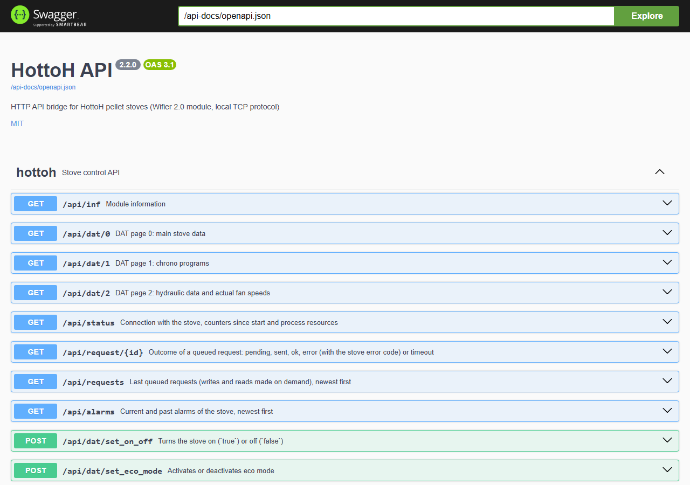

# HTTP API

The web interface uses this API, and so can your scripts and home automation. It is served on the
`[http_api]` port (`3000` by default), without authentication: see
[Security](../README.md#security).

## Swagger UI and OpenAPI

- Swagger UI: `http://<server>:3000/swagger-ui/`, to read the description of every endpoint and
  try it from the browser.
- OpenAPI description: `http://<server>:3000/api-docs/openapi.json`, to generate a client.
- The **Console** page of the web interface does the same with example bodies, and follows the
  outcome of writes.



## Reading the stove

| Endpoint | Content |
|---|---|
| `GET /api/inf` | Module information: host name, firmware version, Wi-Fi signal |
| `GET /api/dat/0` | Main data: state, on/off, eco, chrono mode, temperatures, power, fan set points |
| `GET /api/dat/1` | Chrono programs: mode and temperature of programs 1 to 3 |
| `GET /api/dat/2` | Flow switch, pump, actual fan speeds, puffer/boiler/DHW/room 3 temperatures |
| `GET /api/status` | Link with the stove (`connected`, `connected_since`, `last_response_at`, `last_error`), stove search (`discovery`), `pending_writes`, `uptime_s`, counters (`stats`) and process resources (`process`) |
| `GET /api/alarms` | Current alarm (`current`) and the last 100 alarms (`events`, newest first): `state`, `state_raw`, `started_at`, `ended_at` |
| `GET /api/request/{id}` | Outcome of a write: `pending`, `sent`, `ok`, `error` (with `error_code`) or `timeout` |
| `GET /api/requests` | The last 100 queued requests (writes and reads made on demand), newest first |

The data pages are read continuously from the stove and served from memory. Temperatures are in °C.
Every page has a `last_updated` timestamp; check `connected` in `/api/status` to detect stale data
when the stove is unreachable.

## Controlling the stove

| Endpoint | Body | Accepted values |
|---|---|---|
| `POST /api/dat/set_on_off` | `{"value": true}` | `true` / `false` |
| `POST /api/dat/set_eco_mode` | `{"value": true}` | `true` / `false` |
| `POST /api/dat/set_power_level` | `{"value": 3}` | `index_power_min` to `index_power_max` |
| `POST /api/dat/set_ambiance_temp` | `{"ambiance": 1, "value": 21.5}` | set point min/max of the ambiance |
| `POST /api/dat/set_chrono_mode` | `{"value": true}` | `true` / `false` |
| `POST /api/dat/set_chrono_temp` | `{"chrono": 1, "value": 20.0}` | program min/max from `/api/dat/1` |
| `POST /api/dat/set_fan_speed` | `{"fan": 1, "value": 3}` | 0 to `index_fan_N_set_max` |

Ranges come from the values reported by the stove once they have been read, and fall back to the
firmware limits otherwise. An invalid value is refused with HTTP 400.

### Writes are asynchronous

The answer comes immediately with a `request_id`, before the stove has received the command:

```sh
curl -X POST http://192.168.1.10:3000/api/dat/set_ambiance_temp \
     -H 'Content-Type: application/json' -d '{"ambiance": 1, "value": 21.5}'
```

```json
{"success": true, "request_id": 71, "status_url": "/api/request/71", "message": "..."}
```

`GET /api/request/71` then gives the outcome returned by the stove:

```json
{"request_id": 71, "command": "AmbianceTemperature1", "value": "215", "status": "ok", "attempts": 1, ...}
```

- Writes are sent before the periodic reads and retried up to 3 times.
- Stove error codes: `17` value out of range, `19` the stove board refused the value (Modbus write
  failed).
- When 32 writes are already waiting (stove unreachable), new writes are refused with HTTP 503; a
  write that could not be sent within 60 s ends as `timeout`.
- The last 100 requests are kept.

## Module features

These endpoints use commands of the Wi-Fi module found in its firmware (10.5.0) and in the AppFire
app. Each one is enabled or disabled in [`[features]`](CONFIGURATION.md#features); a disabled one
answers HTTP 403.

Reads are sent to the stove when the endpoint is called and the answer comes back in the HTTP
response (HTTP 504 if the stove does not answer within 30 s, 502 with `error_code` if it refuses).
Writes are asynchronous, like the settings above.

| Endpoint | Feature | Content |
|---|---|---|
| `GET /api/features` | - | Enabled and disabled features |
| `GET /api/chrono/schedule` | `chrono_schedule_read` | Weekly schedule (takes about 2 s, see below) |
| `POST /api/chrono/schedule` | `chrono_schedule_write` | Replaces the schedule of some days |
| `GET /api/clock` | `clock_read` | Module clock (UTC), stove clock (local), offset from the bridge |
| `POST /api/clock` | `clock_write` | `{}` (clock of the bridge) or `{"utc": 1757930400}`: sets the module and stove clocks |
| `GET /api/timezone` | `timezone_read` | `{"zone": "Europe/Paris", "known": true, "available": [...]}` (`available`: names accepted by `POST`) |
| `POST /api/timezone` | `timezone_write` | `{"zone": "Europe/Paris"}`, a name offered by AppFire; the module then sets the stove clock |
| `GET /api/datalog/info` | `datalog_read` | Time of the oldest and newest records |
| `GET /api/datalog?from=<utc>&count=<n>` | `datalog_read` | Records from the first one at or after `from` (default: one hour ago), `count` 1 to 100 (default 60) |
| `POST /api/datalog/clear` | `datalog_clear` | Deletes the whole history |
| `GET /api/pin` | `pin_read` | `{"pin": "..."}`: security PIN of the cloud relay, as set in AppFire |
| `POST /api/pin` | `pin_write` | `{"pin": "a1b2c3"}` (5 to 10 letters or digits); AppFire in cloud mode must be paired again |
| `POST /api/module/restart` | `module_restart` | Restarts the Wi-Fi module (no answer, data unavailable for about 15 s) |
| `GET /api/wifi/scan` | `wifi_scan` | Networks seen by the module (BSSID, SSID, RSSI, security), strongest first |
| `GET /api/cloud` | `cloud_read` | HottoH relay balancer (AppFire cloud mode), 4-noks cloud server, last upload |
| `GET /api/firmware[?refresh=true]` | `firmware_update_check` | Installed firmware, newest one on the HottoH update server, `update_available` |

### Weekly schedule

When chrono mode is on (`/api/dat/set_chrono_mode`), the stove follows a weekly schedule of
half-hour slots, each one running chrono program 1, 2 or 3 (temperatures in `/api/dat/1`) or
none (0). Days go from `sunday` to `saturday`, as in the firmware.

```json
{"slot_minutes": 30, "days": [
  {"day": "monday", "slots": [0, 0, ..., 1, 1, 1, 0, ...], "ranges": [{"start": "06:30", "end": "08:00", "program": 1}]},
  ...
]}
```

The module keeps a copy of the schedule and refreshes it from the stove when asked for it, so the
bridge reads it twice, 2 s apart, to return the current one.

`POST /api/chrono/schedule` takes the days to change, each with `ranges` (the rest of the day gets
no program) or its 48 `slots`. Days left out keep their schedule: the current one is read first.

```json
{"days": [
  {"day": "monday", "ranges": [{"start": "06:30", "end": "08:00", "program": 1}, {"start": "18:00", "end": "22:30", "program": 2}]},
  {"day": "sunday", "ranges": []}
]}
```

### Data logger

The module records the stove every 15 minutes: `utc`, `time`, `power_level`, `room_temp`,
`water_temp`, `smoke_temp` (°C), `state` and `state_raw` (AppFire shows states 50 to 99 as
alarms). To read a long period, ask again from the `utc` of the last record plus one; the list is
empty after the newest record.

### Wi-Fi scan

`wifi_scan` is disabled by default: during the scan the module suspends its link with the stove
board for a few seconds, and its table of security names stops before WPA3. A WPA3 or WPA2/WPA3
network is reported with whatever the module reads past the table (`security: "INVALID"`, the text
in `security_raw`), and in the worst case the module could crash and restart. Tested on a WPA2/WPA3
access point: `security_raw` was `"4"`, no crash, stove link kept.

The module does not tell which network it uses, nor its Wi-Fi password: no command reads the Wi-Fi
settings back.

### Firmware update check

The module cannot tell whether a newer firmware exists. The bridge asks the HottoH update server
(`http://update.hottoh.it/update/upgrade_<major>_<minor>_<patch>.bin`, the files AppFire has the
module download) whether the next patch, minor and major versions exist, with `HEAD` requests over
plain HTTP (nothing is downloaded). The result is kept 6 hours. The update itself is not started by
the bridge: use AppFire.

### Not supported on purpose

The firmware also has commands to change the Wi-Fi settings, update the firmware, register with
the HottoH cloud and change its servers, and to fill the history with test data. They could
disconnect or break the module and are not exposed.

## Home Assistant

A Home Assistant integration installable through HACS is coming soon. Until then, the
[RESTful](https://www.home-assistant.io/integrations/rest/) and
[RESTful Command](https://www.home-assistant.io/integrations/rest_command/) integrations are enough
for sensors and basic control. In `configuration.yaml`, with hottoh_api listening on
`192.168.1.10:3000`:

```yaml
rest:
  - resource: http://192.168.1.10:3000/api/dat/0
    scan_interval: 30
    sensor:
      - name: Stove state
        value_template: "{{ value_json.index_stove_state }}"
      - name: Stove room temperature
        value_template: "{{ value_json.index_ambient_t1 }}"
        unit_of_measurement: "°C"
        device_class: temperature
      - name: Stove smoke temperature
        value_template: "{{ value_json.index_smoke_t }}"
        unit_of_measurement: "°C"
        device_class: temperature
      - name: Stove power level
        value_template: "{{ value_json.index_power_level }}"

rest_command:
  stove_on_off:
    url: http://192.168.1.10:3000/api/dat/set_on_off
    method: POST
    content_type: application/json
    payload: '{"value": {{ "true" if on else "false" }}}'
  stove_set_temperature:
    url: http://192.168.1.10:3000/api/dat/set_ambiance_temp
    method: POST
    content_type: application/json
    payload: '{"ambiance": 1, "value": {{ temperature }}}'
```

In an automation or a script: `action: rest_command.stove_set_temperature` with
`data: {temperature: 21.5}`.
